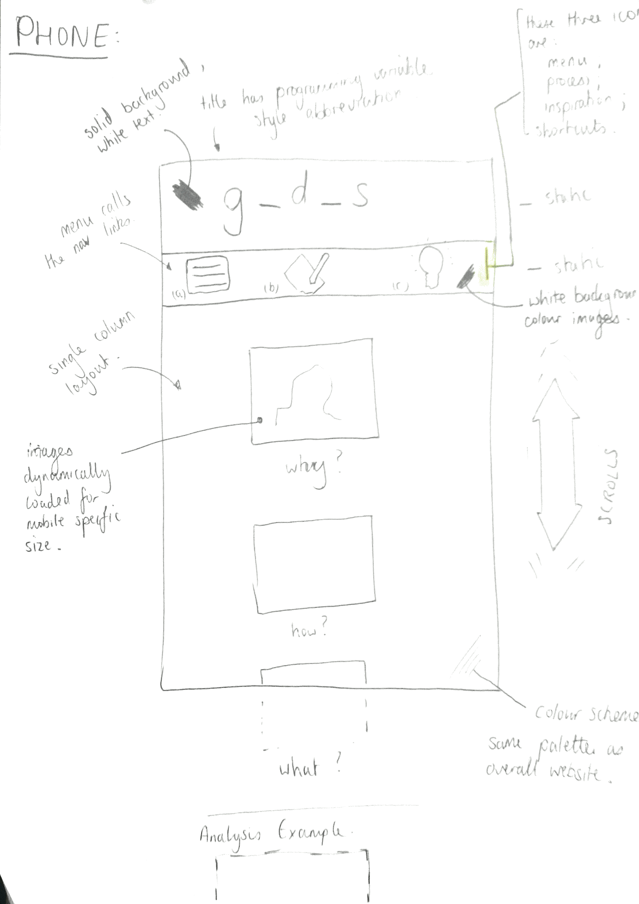
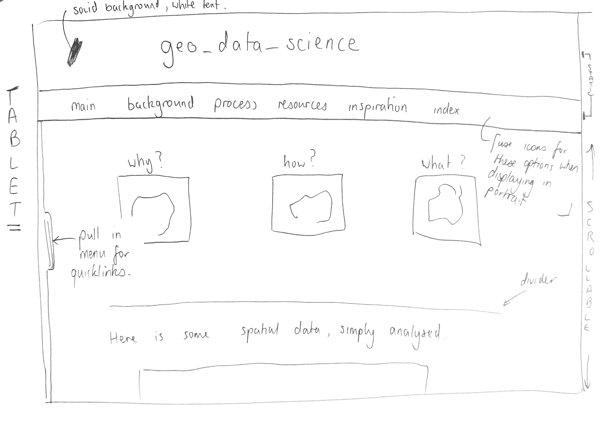
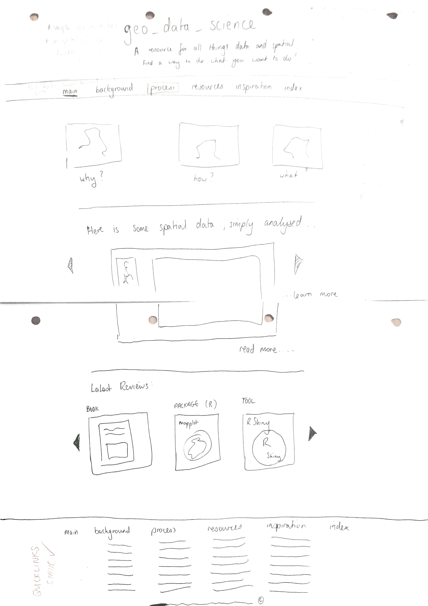

# Design Notes for 'geo_data_sci' web-site.

## Introduction:

### Outline

This website will showcase my interest in all things data-sciencey. It will have;
 * links to good resources
 * exemplar websites (cutting edge technology / visualisations)
 * links to good data-sets
 * reviews (books / packages / courses)
 * practicalities of starting in this field
 * a process map of performing geographical data analysis
 
### Style

It will be a minimalist website, with the following features;
 * flat design
 * sans-serif fonts
 * high contrast colours, with a small palette of 3 to 5 colours used throughout
 
The motivation behind the above choices are that the content should be the highlight of this website. A simple back-drop will allow the subject matter to shine through - placing an even greater emphasis on the requirement to have good content. There will be a lot of code in this website, so a mono-spaced font will be used to identify this, much in the same way that code is typically seen formatted in most IDEs.

### Structure

This website will when fully implelmented have quite a lot of content, and it may become quite deeply layered. A coherent structure in the initial design stages will allow for a logical navigation pattern, so that users can after a few visits, quickly find the type of content they require. This will also fit in with Google's and other search engine service providers' advice that navigable websites do better in terms of Search Engine Optimisation and ranking.  

The navigation function can be accessed in two ways - the ribbon bar below the header, with drop-down menus from main subsection titles, and a quick-link function in the footer, where the level two navigation links all appear below the level one links. This will differ in how it is presented accross the various platforms in order to achieve a responsive design for the website.  

## Design Guidelines:

1. The following guidelines are being utilised in the design of this website:

1.1 Symbols (Metaphors)  
Symbols are being used to represent menu items, as these will be necessary in the mobile version of the website. The 'hamburger', 'lightbulb' and 'wrench' icon will be used to access the menu, inspiration and process menu items respectively.  
1.2 Gestalt Disimilarity  
The simple technique of rendering the link to the currently loaded page will help the user identify where they are in the context of the navigation menus.  
1.3 Map (Metaphor)  
A process map will be utilised to explain the data analysis sequence. The concept of  to visualise complex information will be explored in its ability to represent the data analysis process.  
1.4 Gestalt Similarity / Automatic Processing  
Topics will be linked to with thumb-nail images surrounded by borders with colour coding to represent their theme. There may be a legend somewhere in the page so that the themes are quickly idenifiable, but it is envisaged that the user will eventually learn this colour coding scheme.  
1.5 Gestalt Continuity  
Maps will clearly be a key aspect of this website, and this theme will be used to try to layout the data analysis proces as a map / flow-chart, where users can intrepret the sequential and iterative processes of data analysis in an intuitive manner.  
1.6 Mental Models  
Many mental models will be touched on in this website - the geospatial nature of the subject matter and hence the potential users interest/knowledge of this area lends itself to use of cartographic themes and mental models - perhaps contour lines or cardinality (to be developed / refined / rejected in the final version !). It also has an information science leaning, so aspects of this area of interest will be utilised - the use of non-serif fonts throughout, and non-capitalised "h1" titles with underscores replacing whitespace (more than this would probably get annoying).  

## Outline Sketches

